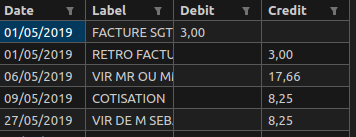

# credit-mutuel-to-csv
Convert 'extrait de compte' pdf to csv file

This script convert all 'credit-mutuel' pdf files in a directory to a unique csv file sorted by date.

Pdf input example:


Csv output example:




## Prerequisites

### Install python3.x
### Install required packages

```bash
$ pip install -r requirements.txt

```

## Usage (linux)

### Help
```bash
$ ./cm2csv.py convert --help
Usage: cm2csv.py convert [OPTIONS]

Options:
  --directory TEXT       Directory containing PDF files.  [required]
  --csv_path TEXT        Path for the output CSV file.  [required]
  --filter_strings TEXT  Strings to filter out from the table.
  --help                 Show this message and exit.
```


### Convert
```bash
$ ./cm2csv.py convert --directory ./pdf/ --csv_path output.csv
```

where `--directory` is the directory containing the pdf files to convert and `--csv_path` is the path of the output csv file.

## Usage (windows), I guess ?

```bash
$ python cm2csv.py convert --directory pdf\ --csv_path output.csv
```

where `--directory` is the directory containing the pdf files to convert and `--csv_path` is the path of the output csv file.
